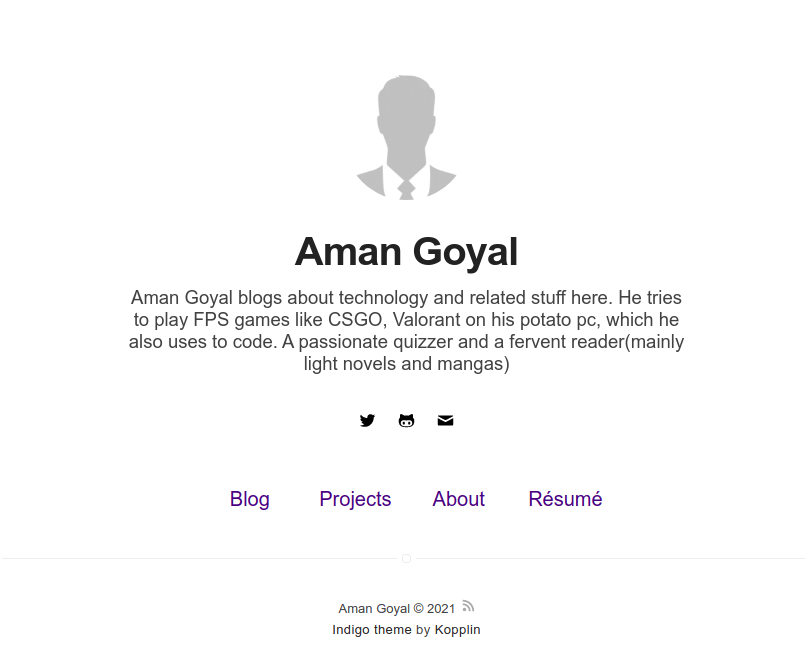

    <h2 align="center">Indigo Minimalist Jekyll Template - <a href="https://amangoyal.me/">My website</a> ·   </h2>

This is a simple and minimalist template for Jekyll for those who likes to eat noodles.

***

    

## What has inside

- [Jekyll](https://jekyllrb.com/), [Sass](https://sass-lang.com/) ~[RSCSS](https://rscss.io/)~ and [SVG](https://www.w3.org/Graphics/SVG/);
- Tests with [Travis](https://travis-ci.com/);
- Google Speed: [100/100](https://developers.google.com/speed/pagespeed/insights/?url=https%3A%2F%2Famangoyal.me%2F);
- No JS (except for the javascript used on the /search page). :sunglasses:

---
## License

[MIT](https://kopplin.mit-license.org/) License © Sérgio Kopplin
